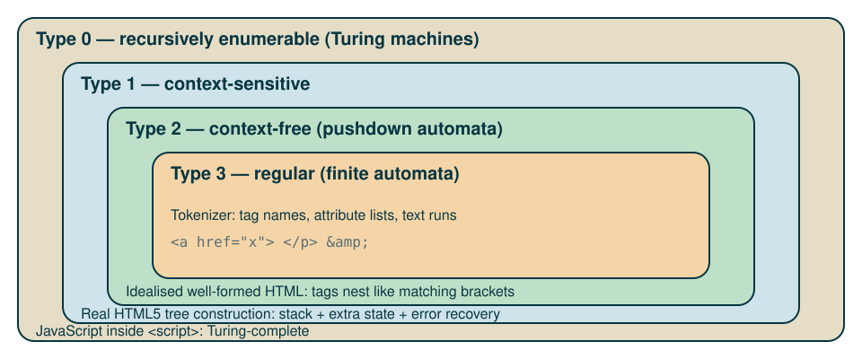

# Introduction

---

## Learning objectives

* describe HTML as a language: alphabet, tokens, grammar, derivations

* (some) reference to formal languages and the Chomsky hierarchy
  
* from HTML page to a **tree** (the Document Object Model)

* from page to DOM to JavaScript and CSS

---

## A mental model for the pipeline

envision the web page (and visit *experience)*

code a HTML file with the needed tags, text, images etc.

the browser reads our HTML and create an internal tree-shaped representation, the DOM

next, it reads the CSS style file and *decorates* each element of the DOM with style annotation

next, it executes the Javascript code, which could change the DOM

finally, render the DOM in the browser window


---

## The pipeline in one picture

{fig-alt="Pipeline: bytes, characters, tokens, tree building, DOM" .r-stretch}

::: incremental
* bytes → characters: *encoding* (usually UTF-8)
* characters → tokens: a **finite-state** tokenizer
* tokens → tree: a **stack-based** tree builder
:::

::: notes
Source of truth: the WHATWG HTML Living Standard, section "Parsing HTML documents". The spec is written as an explicit algorithm, not as a grammar.
:::

# HTML as a formal language

---

## Alphabet and tokens

* **alphabet** $\Sigma$: Unicode characters

* the tokenizer groups characters into a small set of token types:

| token | example |
|---|---|
| DOCTYPE | `<!DOCTYPE html>` |
| start tag (+ attributes) | `<a href="x.html">` |
| end tag | `</a>` |
| character (text) | `Hello` |
| comment | `<!-- note -->` |
| end-of-file | |

* tag and attribute *names* come from an open-ended lexicon, but each element has a fixed content model

---

## A grammar (simplified)

```text
document   ::= doctype? element
element    ::= start-tag content* end-tag
             | void-tag                      (br, img, meta, ...)
start-tag  ::= "<" NAME attribute* ">"
end-tag    ::= "</" NAME ">"
void-tag   ::= "<" VOID-NAME attribute* ">"
attribute  ::= NAME ( "=" VALUE )?
content    ::= element | TEXT | comment
```

. . .

**Side condition** (not context-free by itself): the `NAME` of the end tag equals the `NAME` of its start tag.

With a *finite* vocabulary of names this can be encoded in the grammar, at the price of one rule per name.

---

## One derivation

Input: `<p>Hi <em>you</em></p>`

```text
element
⇒ start-tag content* end-tag
⇒ <p> content* </p>
⇒ <p> TEXT element </p>
⇒ <p> Hi  start-tag content* end-tag </p>
⇒ <p> Hi  <em> TEXT </em> </p>
⇒ <p> Hi  <em> you </em> </p>
```

. . .

The **derivation tree** is (almost) the DOM: the tree is the meaning of the text.

---

## Where does HTML sit?

{fig-alt="Nested regions: regular inside context-free inside context-sensitive inside recursively enumerable, with HTML components placed" .r-stretch}

::: notes
Pedagogical placement, not a theorem. Tokenizer: a finite-state machine. Well-formed nesting behaves like matching brackets: every start tag must be closed by its end tag, in reverse order of opening. The set of correctly bracketed strings is the textbook context-free language (called the Dyck language), which is why nesting sits in the context-free ring. The real tree-construction stage needs more than a stack of open elements: it also keeps a list of open formatting elements (such as `<b>` and `<i>`) and a state called the "insertion mode", which says which rules apply at that point (for example, inside a table). It can also reprocess a token under different rules. That goes beyond a plain pushdown automaton. Do not claim more than this.
:::

---

## A language that never says "no"

Most formal languages *reject* strings. The HTML5 parser is **total**: every input yields a tree.

* legacy of the 1990s: browsers were forgiving, so pages were sloppy

* the standard now specifies the recovery precisely, so all browsers build *the same* tree

* consequence: "is this valid HTML?" (conformance checking: does the text obey the standard's authoring rules?) and "what tree does the browser build?" (parsing) are **different questions**

---

## Error recovery, graphically

{fig-alt="Two inputs and the trees the parser builds: implied end tags for p, an inserted tbody in a table" .r-stretch}

* also implied: `<html>`, `<head>`, `<body>` when you omit them

* try it: paste both fragments into a page and inspect them in Firefox DevTools

# The DOM

---

## Source text vs tree

{fig-alt="A small HTML document on the left and its DOM tree on the right" .r-stretch}

::: notes
Point out: indentation whitespace in the source also creates text nodes in the real DOM. The figure omits them for readability.
:::

---

## A minimal example

:::: {.columns}

::: {.column width="42%"}
```html
<html>
  <head>
    <title>My Document</title>
  </head>
  <body>
    <h1>Header</h1>
    <p>Paragraph</p>
  </body>
</html>
```
:::

::: {.column width="50%"}
```{mermaid}
%%| echo: false
flowchart TD
    html["HTML"] --> head["HEAD"]
    html --> body["BODY"]
    head --> title["TITLE"]
    title --> t1(["My Document"])
    body --> h1["H1"]
    body --> p["P"]
    h1 --> t2(["Header"])
    p --> t3(["Paragraph"])

    classDef element fill:#268bd2,stroke:#073642,color:#fdf6e3,stroke-width:2px;
    classDef text fill:#eee8d5,stroke:#073642,color:#073642,stroke-width:2px;
    class html,head,body,title,h1,p element;
    class t1,t2,t3 text;
```
:::

::::

* rectangles: element nodes; pills: text nodes

::: notes
Same example document as on the MDN page "Using the W3C DOM Level 1 Core". The real DOM also contains whitespace text nodes for the indentation; the diagram leaves them out. The Mermaid source is also saved as imgs/07-doctree.mmd.
:::

---

## Node types

| `nodeType` | interface | in the tree |
|:--|:--|:--|
| 1 | `Element` | `<p>`, `<em>`, ... |
| 2 | `Attr` | `id="t"` |
| 3 | `Text` | character data |
| 8 | `Comment` | `<!-- ... -->` |
| 9 | `Document` | the root |
| 10 | `DocumentType` | `<!DOCTYPE html>` |

. . .

* all are `Node`s; the tree is an ordered, rooted tree with a single parent per node

* attributes hang *off* elements (dashed in the figure): they are not children

---

## Walking the tree

{fig-alt="A list element with arrows to parent, siblings and first child" .r-stretch}

---

## The same walk in JavaScript

```javascript
const li = document.querySelector("li:nth-child(2)");

li.parentNode;         // the <ul>
li.previousSibling;    // may be a whitespace Text node!
li.nextElementSibling; // skips non-element nodes
li.firstChild;         // the Text node "Two"
```

. . .

**Gotcha**: `childNodes` includes text and comment nodes; `children` lists elements only.

---

## The DOM is not the source

| | *View source* | *Inspector / Elements panel* |
|:--|:--|:--|
| shows | the bytes received | the **live** tree |
| includes parser fixes (`tbody`) | no | yes |
| includes script changes | no | yes |

. . .

* JavaScript reads and edits the *tree*, never the text

* CSS selectors match against the *tree*: `ul > li:first-child` is a query on parent/child relations

---

## Mutating the tree

```javascript
const item = document.createElement("li");   // new Element node
item.textContent = "Four";                   // new Text child
item.setAttribute("class", "new");           // Attr on the element
document.querySelector("ul").append(item);   // attach: now it is in the tree
```

* until it is attached, the node exists but is not part of the document

* after attachment the browser re-renders: the tree is the single source of truth

---

## From DOM to pixels

{fig-alt="HTML and CSS parsed into DOM and CSSOM, combined into a render tree, then layout and paint" .r-stretch}

* **CSSOM** (CSS Object Model): the tree-like structure the browser builds from the CSS rules; it is to styles what the DOM is to the document

::: notes
Only sketch here: rendering is developed in a later session.
:::

# Wrap-up

---

## Exercise

1. Choose a real page. In Firefox DevTools open the **Inspector** and sketch the DOM of its `<header>` as a tree: element nodes, text nodes, attributes.

2. Write a *tiny* HTML fragment where the browser's tree differs from the tree you would draw from the source (hint: `<p>`, `<table>`, or tags closed in the wrong order, e.g. `<b><i>text</b></i>`).

3. Write down the derivation of a 5-line page from the grammar above. Where does your grammar fail?

---

## Take-aways

* HTML text is a **string in a language**; the DOM is its **parse tree**, made into a live data structure

* the tokenizer is regular, nesting is context-free, the real parser is an **algorithm** that accepts everything

* all later tools (CSS, JavaScript, accessibility) work on the *tree*

---

## Further reading

* [WHATWG HTML Standard: parsing](https://html.spec.whatwg.org/multipage/parsing.html)

* [WHATWG DOM Standard](https://dom.spec.whatwg.org/)

* [MDN: Introduction to the DOM](https://developer.mozilla.org/en-US/docs/Web/API/Document_Object_Model/Introduction)
