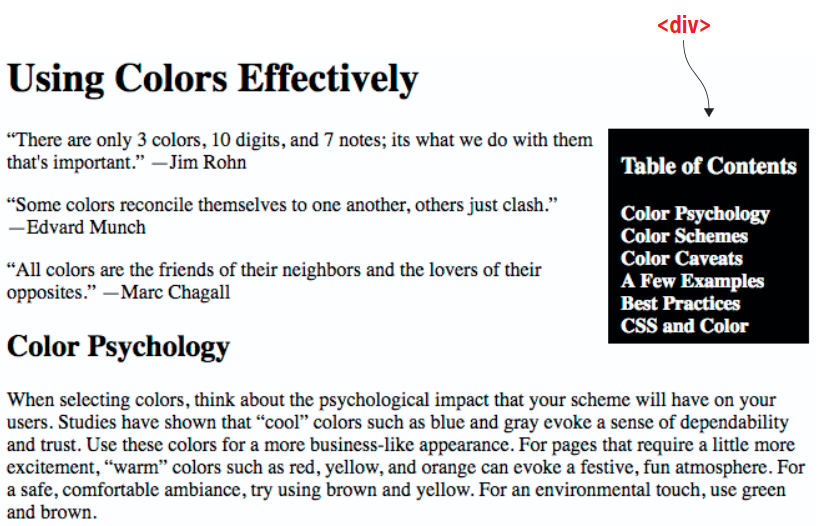
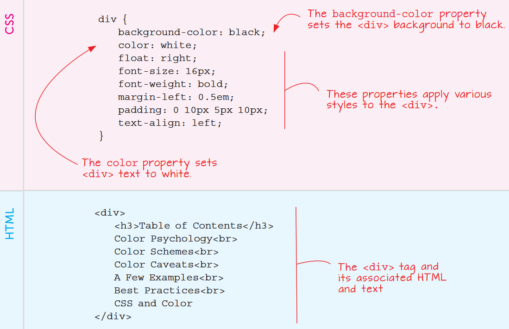

# Structural tags


---

## Hierarchical

Titles are rendered with the simple ``<h1>`` to ``<h6>`` tags.

The now-obsolete ``<hr>`` divides text without a title.


## Lists

Several styles for lists are available, try toggling ``ul`` for ``ol``

```html
<ol>
  <li>first item</li>

  <li>second item</li>
</ol>
```

see [W3schools](https://www.w3schools.com/html/html_lists.asp) for a detailed description

---

## Navigation Panels 

See [wdpg.io/4-9-1](https://webdesignplayground.io/lessons/4-9-1/) (and p. 67 of the textbook)




---

## Navigation Panels, cont'd 

use special styles and ``div`` or ``span`` to capture attention to a text




# Screen-oriented structure

---

## Beyond page

Unless most paper pages (books, magazines etc.), web pages might have a *variable layout* with different contents and styles


Specific layout tags will help us style the sections independently

Deploy **semantic tags**
