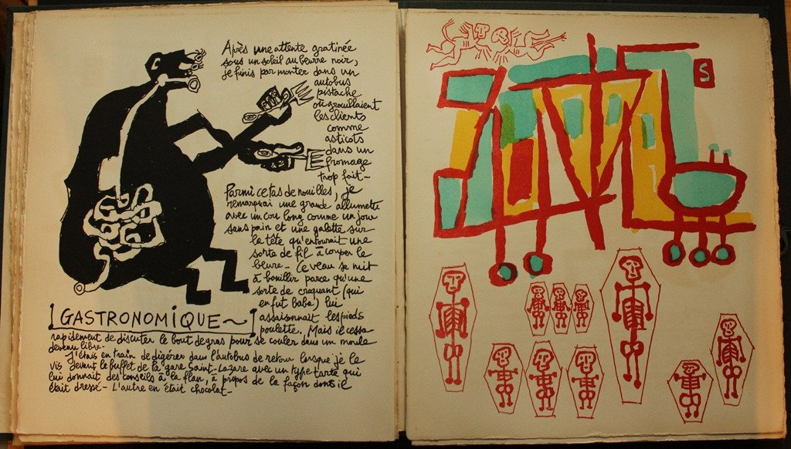
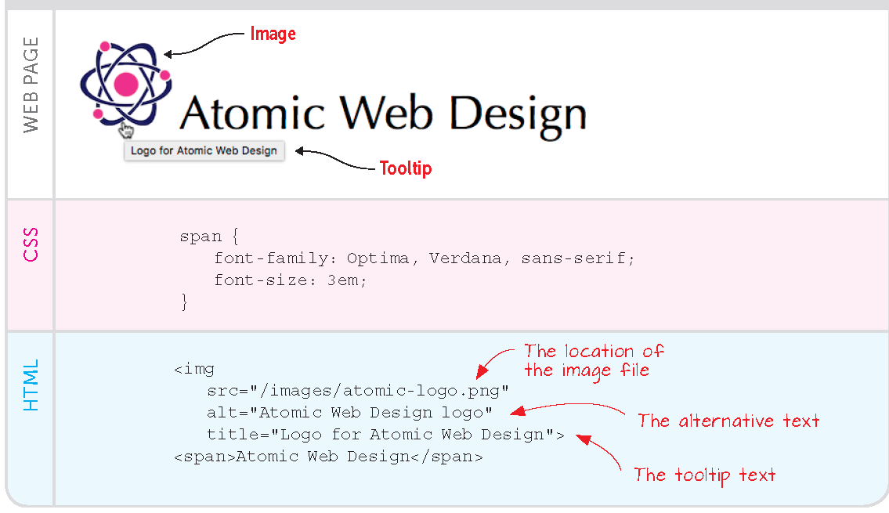
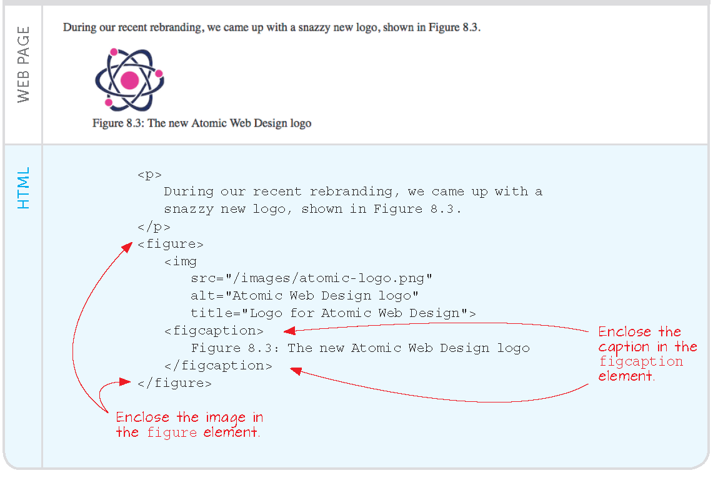
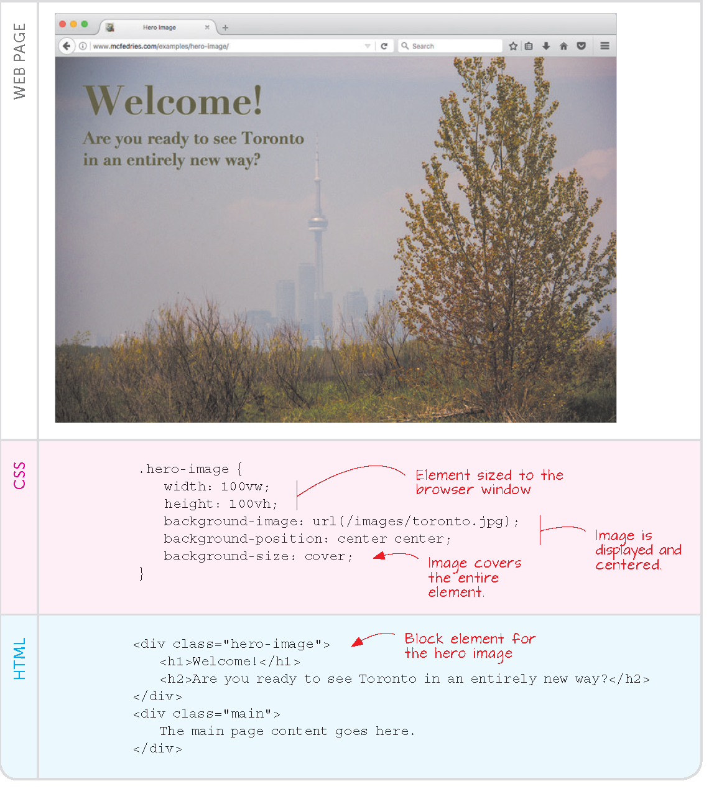
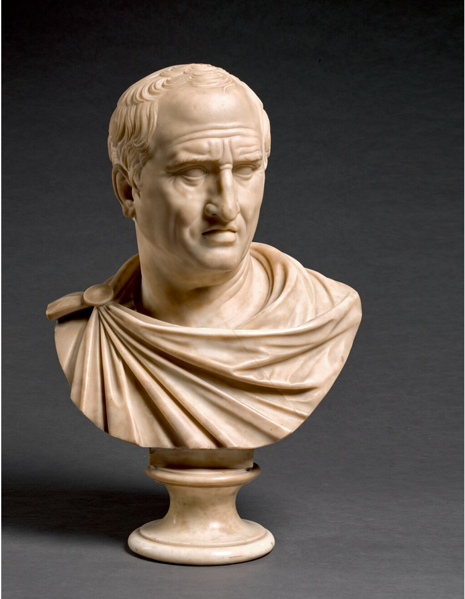
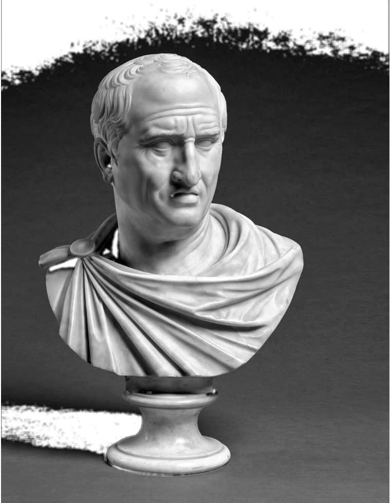

# Visuals

---

## The digital page, so far

- a HTML file on our computer
  
- beside, a CSS file with custom styles

- the page is *digital* but static, unconnected


- focus on *style:* look again at the [csszengarden.com]


---

## CSS styles

Even though style settings can go almost anywhere in HTML pages, we keep them *segregated* in CSS files.

This line must be inside the `<head>` part:


```html
  <link href="mystyle.css" rel="stylesheet" type="text/css" />
```  

In this case `mystyle.css` must be in the same folder as the HTML file.

---

## Case: the CSS file is in a different folder 

In a sub-folder:

```html
  <link href="./css/mystyle.css" rel="stylesheet" type="text/css" />
```  

In the folder above:

```html
  <link href="../mystyle.css" rel="stylesheet" type="text/css" />
```  

in a parallel folder:

```html
  <link href="../css/general_site_style.css" rel="stylesheet" type="text/css" />
```  

---

## Case: there are several styles

```html
  <link href="../css/general_site_style.css" rel="stylesheet" type="text/css" />

  <link href="./css/specific_section_style.css" rel="stylesheet" type="text/css" />
```  

Cascading effect: 

if both define an element of style, e.g. `font-color`, then the setup in the latter *wins* 


---

## Case: the style file is somewhere else in the file system

```html
<link href="c:/path/to/the/css/folder/style.css" rel="stylesheet" type="text/css" />
```  

---

## Case: the style file is online

We *borrow* the style from an online resource

```html
<link href="https://csszengarden.com/examples/style.css" rel="stylesheet" type="text/css" />
```

---

## Side project 

get [csszengarden.com/](https://csszengarden.com/214/) styles from [github.com/mezzoblue/csszengarden.com](https://github.com/mezzoblue/csszengarden.com)


Try out a version of your page with Zengarden looks, e.g., *Verde Moderna* or *Tranquille*

```bash
git clone https://github.com/mezzoblue/csszengarden.com.git
```

Challenge: you can clone directly from VS Code, thanks to the Git extension?


# Images

---

## Including images


Browsers pick up image files and incorporate them in the rendering of the page

The HTML code will link image files in the same way as it links to the CSS file

The `` tag has parameters that control the exact rendering of the image

```html

```

Notice: there is no `</img>`

---




---

## Online image embedding

```html

```


Try embedding the Uni logo in your Lorem (or exercise-35) page

Warning: we are *leasing* an area of the page to the source site

---

## a Brief on formats

- photo-oriented: they describe a *bitmap*: `.bmp`, `.jpg` and `.png`

- animation-oriented: `.gif`
    
- rendering oriented, total control: they contain code that creates the image in the context: `.svg`


---

## Figures

Different from simple embeddings, figures may have numbering, caption and be treated uniformly with the `<figure></figure>` tag




Details in Ch. 6 of the textbook


---

## Images as decor

- an image can become the background of the page or portions thereof

- with *tiling* the same pattern/logo can be repeated throughout arbitrary surfaces
  
- details in Ch. 6 of the textbook


# Custom styles

---

## Motivations

CSS definitions can *customise* the standard HTML tags

However, there are few of those and CSS will change all its instances at once

Example

```css
p {
  align: right;
}
```

aligns the whole document to the right...


---

## Visual classes

Create ad hoc styles via new classes

Each class name needs be unique and begin by `.`

```css
p {
  text-indent: 12pt;

  align: left;
}

.latinpara {
  text-indent: 4pt;

  align: right;
}
```

---

```html
<p>This is a presentation of an ancient text. Its author is Cicero.</p>

<p class="latinpara">Lorem ipsum ... </p>
```

---

## Draft new styles

Go to the Web Design Playground:

[https://webdesignplayground.io/lessons/7-4-0/](https://webdesignplayground.io/lessons/7-4-0/)

---

## The CSS is what makes the site

Site [css-tricks.com/](https://css-tricks.com/) is a simple list of technical announcements: software bugs, new releases etc.


# The *hero image*

---

## An inviting visuals

Static pages now tend to start with a graphical upper part which is repeated for all pages: the *hero image*

---



---

For hero images, and only for them, it makes sense to have a specific form of title, which is attuned to the image itself, e.g., matches its second or third color, has specific font etc.


---

The CSS file can accomodate an hero image layout by 

- specific classes
  
- the `background` attribute to a class

---


---

#### Web-native illustration, 2

Can your replicate a hero page with this `.jpg` file? (click to enlarge)

{width=5in}

boilerplate in [learn-web\30-visuals\exercise]()

---

{.lightbox}


## Exercise

:::: {.columns}
::: {.column width="75%"}
Find a hero image for your Lorem or exercise-35 page

be creative around classic images

develop a CSS with special classes for title, claim etc. *over* the picture
:::

::: {.column width="5%"}
<!-- empty column to create gap -->
:::

::: {.column width="20%"}
[](https://www.sothebys.com/en/buy/auction/2019/old-master-sculpture-works-of-art/italian-circa-1800-after-the-antique-bust-of)
:::
::::


:::: {.columns}
::: {.column width="20%"}
[](https://www.sothebys.com/en/buy/auction/2019/old-master-sculpture-works-of-art/italian-circa-1800-after-the-antique-bust-of)
:::
::: {.column width="5%"}
<!-- empty column to create gap -->
:::
::: {.column width="75%"}
the colors in the picture drive the choice of the "on top" style

discuss the page with a colleague 
:::
::::
