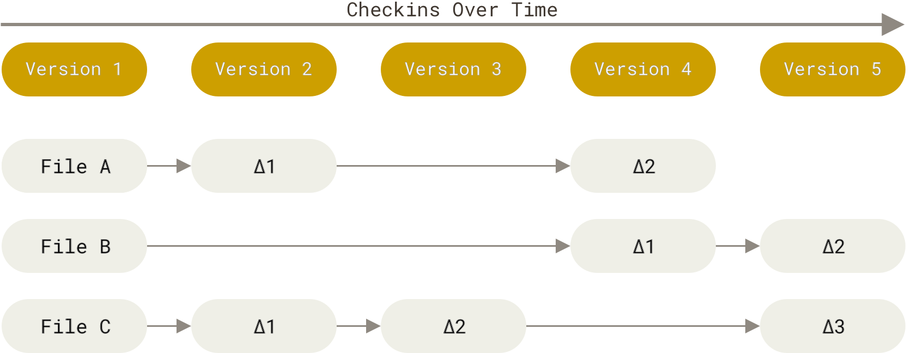
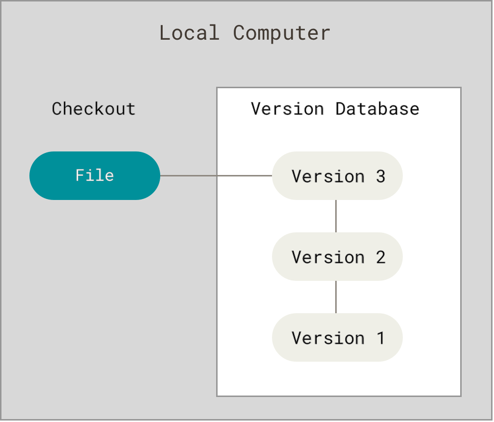
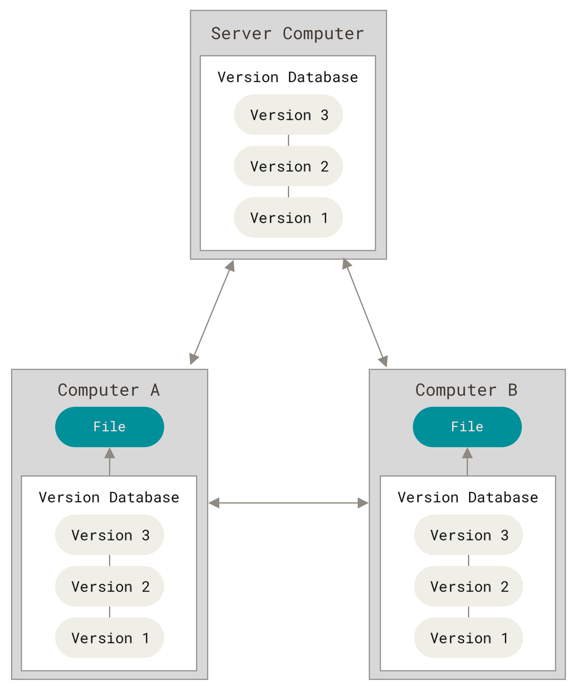
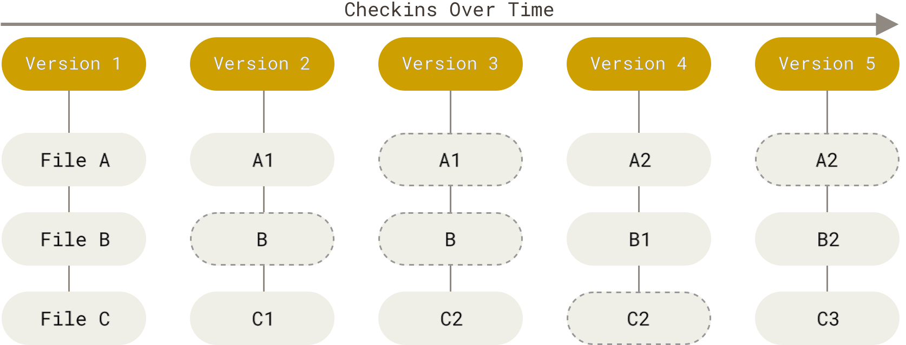
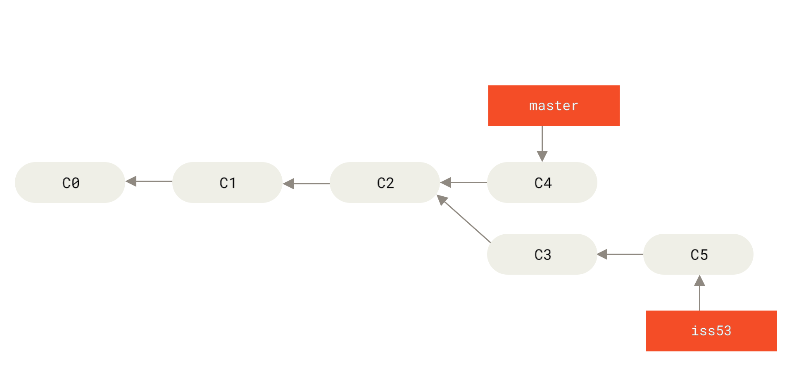
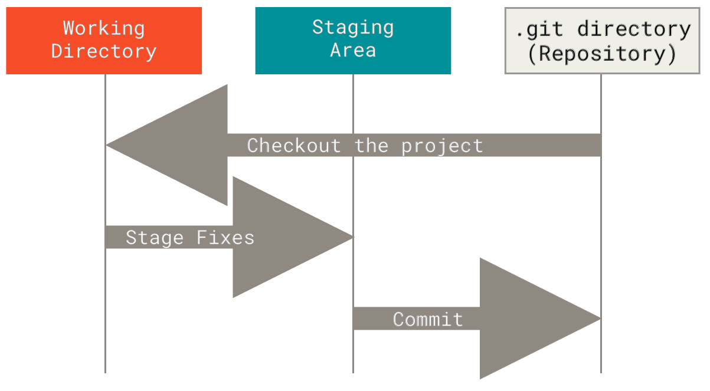

# Learning objectives

---

## Topics

- the *versioning* of documents and source code
  - track/review progress and collaboration

- Git concepts
  - version, repository, clone, commit, push, pull

- GitHub: Git + Hub 
  
- Installing the Git client

- The everyday commands to synchronise a local copy with GitHub

Official [Hello World tutorial](https://docs.github.com/en/get-started/using-github/hello-world)


# Versioning documents

---

## Concept: version

a saved state of a document/folder which

- is part of a long-term project
- has a name and a specific footprint *somewhere*


Everybody does it by hand:

`thesis.docx`, `thesis_v2.docx`, `thesis_final.docx`, `thesis_final_REALLY.docx`

---

## Issues with manual file-name versioning

- which one is current? On which folder is it?
- Ok, but what changed? 
- On which computer/cloud/USB pen is the last version?
- *it's bad, I want to go back*
- I accidentally deleted a good sentence/code
- the code doesn't work anymore, I want to go back!

. . .

- who changed it?
- Oh no, Stelios overwrote my fantastic solution


---

## Version control system (VCS)

Software that records the history of a set of files:

- every saved state, with *who*, *when* and *why*
- comparison between states
- return to any earlier state

::: {.fragment}
Works best on *plain text* (`.py`, `.qmd`, `.html`, `.css`): changes can be compared line by line
:::

---

## Git 

an open *protocol* that is implemented by several VCS

Focus on coding, alone, on one computer, on a long project (Linux OS)

Extends to general editing (thesis), collaborative, distributed

Underpins Cloud versioning (MS OneDrive, Dropbox, PCloud, Google Drive)

---

## Storing versions: deltas

Classic VCS store, for each file, the list of *changes* over a base version

{fig-alt="Delta-based version storage" width="85%"}


(all images from [git-scm.com/book](https://git-scm.com/book/en/v2))

---

## Collaborative coding

two or more edit the *same* files at the same time

- destructive save: the last save may overwrite all previous saves:

  - a **conflict** to avoid losing previous work
- 
  - won't allow Stelios to overwrite my fantastic code
  
- tracking changes and responsibilities

- testing ideas on shared files without compromising them

---

## Git: Centralised versus distributed

::::::: {.columns}
::: {.column}
**Centralised**: one server holds the history

{width="90%"}
:::
::: {.column}
**Local only**: history on one machine

{width="90%"}
:::
:::::::

---

## Distributed Git

Every collaborator holds a full copy of the history

{width="35%"}


# Git concepts

---

## Concept: repository

a folder of files *plus* its complete history, stored in a hidden `.git` folder

Two flavours of the same repository:

- **local**: on your computer
- **remote**: on a server (e.g., GitHub), by convention named `origin`

---

## Concept: commit

a saved *snapshot* of the whole project at a moment in time

Each commit has:

- a unique id (a hash, e.g. `a1b2c3d`)
- an author and a date
- a *message* saying what and why
- a pointer to the previous commit(s)

---

## Snapshots vs. deltas

Each commit records what all files look like; unchanged files are just linked

{fig-alt="Git snapshot storage" width="90%"}


---

## Git history

- a chain of commits

- each commits points back to its parent; a *branch* is a movable label on a commit

{width="70%"}


---

## Git Staging

within a directory, not all files need versioning, e.g., `thesis.pdf`

- *working directory*: the files you edit
- *staging area*: what goes into the next commit
- *repository*: the committed history

{width="65%"}


---

| Term | Meaning |
|---|---|
| **clone** | copy a remote repo, with its history, _here_ |
| **commit** | save a snapshot in the *local* repository |
| **push** | send your new commits to the remote |
| **fetch** | download new remote commits, without merging |
| **pull** | fetch + merge into your current branch |

. . .

Commit is *local*: nobody sees it until you push


# Getting started

---

## Install: Win

Open a terminal or a PowerShell *in administrator mode*

```bash
>choco install git
```

. . .

```bash
>git --version
```

Other methods are be available

---

## Install: MacOs

Open a terminal

```bash
>brew install git
```

. . .

```bash
>git --version
```

Other methods are be available


---

## Get a fresh copy of the repository

From the folder where you want to save your copy of the repo

```bash
>git clone https://github.com/ale66/learn-coding.git
```
---

## Update your copy of the repository

**inside** the folder where you want to save your copy of the repo

```bash
>git pull
```

---

## Check whether you changed local files 

```bash
>git status
```

No change will affect the copy on `github.com`, for the moment

---

## Discretionary: first-time configuration

Same on both systems; your name and email will label every commit

```bash
git config --global user.name "Alessandro Provetti"
git config --global user.email "alessandro.provetti@unimi.it"
git config --global init.defaultBranch main
```


# Working with GitHub

---

## Start of the day

Open the folder that is versioned on GH

Spin up a terminal that works *there*

Win:

```bash
>dir
```

MacOS:

```bash
>pwd
>ls -lrta
```

---

## Get in synch with the project

What did we do yesterday?

```bash
>git status
```

Update your copy of the repo to that on GH

```bash
>git pull
```

Save your work into the project

```bash
>git commit -a -m "This is what I did yesterday, It is ready for sharing"
```

---

## Issues

Several things can go wrong, when the code base changes quickly

```bash
Updating 4c7822c..5bbdd1b
error: Your local changes to the following files would be overwritten by merge:
        30-iterables/case-study.ipynb
Please commit your changes or stash them before you merge.
Aborting
```

---


OK, stash my changes away in a safe place

```bash
>git stash
```

Pull in the new version from GH

```bash
>git pull
```

Put my changes back in

```bash
>git stash pop
>git commit -a -m "I incorporate my changes from yesterday"
>git push
```


