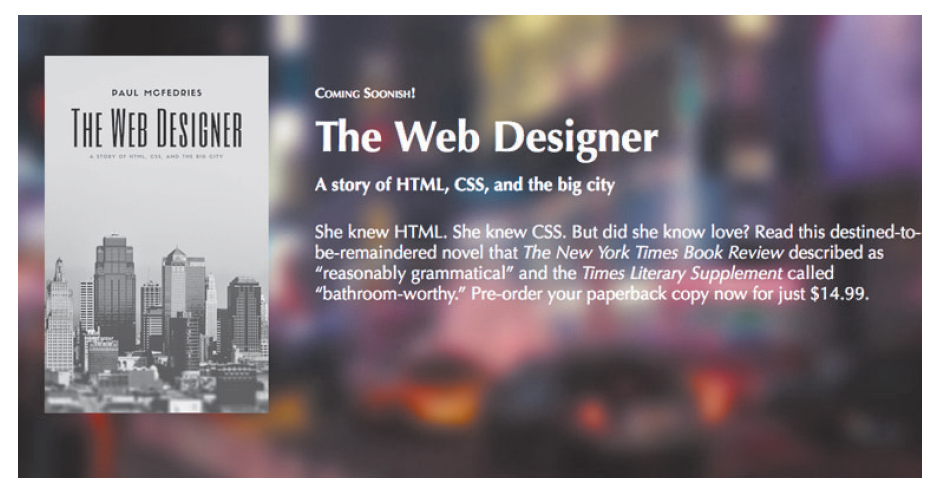

#### Webcomm 4-b

### Ch. 10: Creating a landing page

---

#### The static landing page

*The landing page's job is to explain the product or service and to induce the user to perform some action, such as buy the item, subscribe to the service, or sign up for a newsletter.*


---

#### Sketch ideas on paper  

* ask you collague to go over the concept: can you explain it?

* your thesis project is *essentially* a landing page: it should invite further reading


---

#### Select a color scheme

Apply the color scheme consistently across your site.


---

#### Select a color scheme, 2


[Spazio70](https://spazio70.com/il-progetto-spazio70/): punchy but ok.

Idea: continue colors seen in an important picture for your thesis, one which is likely to become the *hero picture.*

---

#### Living philosophers, 1

Michel Onfray: materialism, hedonism etc.

[](https://en.wikipedia.org/wiki/Michel_Onfray)

black, white, pink-ish?

---

#### Living philosophers, 2

Bernard-Henry Lévy: something about democracy?

[](https://www.britannica.com/biography/Bernard-Henri-Levy)

white, grey, green?

---

#### The Making of the Hero header, 1

Please allow plenty of space at the top: visitors are going to scroll down if it needs to.


A specific div puts the hero image up.

---

#### The Making of the Hero header, 2


Ok, float this one left


---

#### The Making of the Hero header, 3



Float text right:


---

#### The Footer

Links to social media are *de rigueur*

Find ``.tif`` icons online


  

Link your uni via their logo

---

```html
<a href="https://www.unimi.it/">linked text</a>
```

---

```html
<a href="https://www.unimi.it/"></a>
```

---

#### A method to your in-class project


---

#### A method to your in-class project, 2


Recalibration to your project:

header/hero, title, links, summary, social media links and footer with your details.
