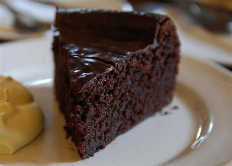

# In the morning

## Getting up

- Turn off alarm
- Get out of bed

## Breakfast

- Eat eggs
- Drink coffee

# In the evening

## Dinner

- Eat spaghetti
- Drink wine

------------------

## Going to sleep

- switch off light

. . . 

- Count sheep

. . . 

- __if__ still can't sleep __then__ read the [online Pandoc tutorial](https://pandoc.org)